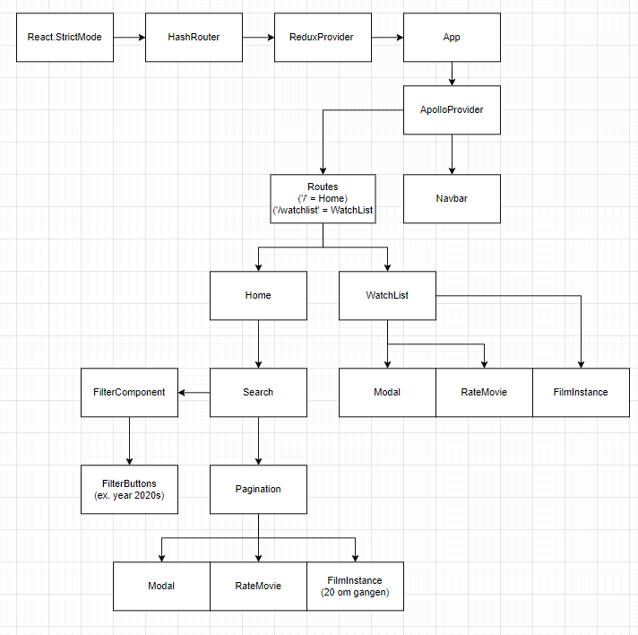

Vi har laget en nettside for søking, filtrering, sortering, blaing og resultatpresentasjon av filmer.

# Hvordan kjøre applikasjonen lokalt
 - `npm install`

 - `npm start`

NB! Må være koblet til NTNU-nettverket for at all funksjonalitet skal kunne fungere, siden databasen og API’et kjøres på en virtuell maskin på NTNU-nettverket

# Hvordan kjøre testing
 - Kjør applikasjon (dvs. utfør de 2 stegene ovenfor)
 - `npm run test` (for å kjøre Jest testene)
 - `npm run test-cypress` (for å kjøre cypress testene)

# Valg

## Teknologistack
Søkeapplikasjonen vår er bygget og basert på teknologistacken **GRAND**:
 - **G**raphQL
 - **R**eact
 - **A**pollo
 - **N**eo4j **D**atabase

Vi valgte denne teknologistacken fordi vi fikk inntrykk av at den gjorde det enkelt for de ulike lagene av stacken å kommunisere med hverandre, og fordi faglærer anbefalte stakken i én av forelesningene sine. Når man ikke har erfaring med fullstack-webutvikling fra før av er det tryggeste å følge anbefalinger.

## Datasett
Dataen vi bruker er hentet fra Internet Movie Database (IMDb): https://datasets.imdbws.com/. Vi har modifisert to ulike datasett fra IMDb slik at det kombinerte datasettet vi bruker inneholder film-objekter med attributter som tittel, gjennomsnittlig rating, sjangre, antall stemmer, varighet, og utgivelsesår. Vi har filtrert ut alle TV-serier og lignende, slik at nettsiden utelukkende omhandler filmer. Totalt inneholder vårt datasett 249 220 film-objekter. Datasettet ble omgjort til csv-filformat slik at det lett kunne importeres i neo4j. 

Vi har valgt å bruke data fra IMDb fordi de har store og lett forståelige datasett. Et stort datasett gjør det lettere å teste ut filtrering på mange kategorier og kombinasjoner av forskjellige filter.

Noe vi ikke gjorde med databasen var relasjoner mellom noder, da vi ikke så poenget med bruk av relasjoner når vi bare bruker film-objekter. Hadde vi tatt med skuespillere eller andre personer knyttet til filmproduksjon, kunne vi knyttet opp relasjoner mellom dem og filmene de har jobbet på. 

## Mappestruktur
Prosjektet er initialisert med create-react-app. Videre har ulike deler av applikasjonen blitt satt i forskjellige mapper. I src/ har vi egen mappe for komponenter, API (til apolloserveren), global state, GraphQL, bilder, sider, og typer. Innenfor komponent-mappen har vi en egen mappe for hver komponent som inneholder selve komponenten og tilhørende css-modul i to separate filer. Formålet med filstrukturen vår er å gjøre prosjektet lett og oversiktlig, og å dele opp prosjektet i mindre komplekse deler.

## Komponenter

*Fig. 1: Komponenttreet i react-applikasjonen*

Figuren over viser komponenttreet i react-applikasjonen. Noe vi kunne ha gjort annerledes er å ha Pagination-komponentet koblet til Home i stedet for Search, og ha Search, FilterComponent, og FilterButtons som en egen gren i Home. Samtidig kunne vi også hatt et SortingComponent-komponent slik at det ikke skjer direkte i Search-komponentet (slik som er per nå).

## GraphQL

Vi har tre GraphQL-filer knyttet til mutasjon av data, spørring av data, og et type-skjema for Apollo-serveren.
 - `mutation.ts` inneholder GQL for å oppdatere antall ratings og den gjennomsnittlige rating-scoren til et filmobjekt. For å bruke denne mutasjoner har vi brukt Apollos `useMutation`-hook fra `@apollo/client`-biblioteket der vi også sender inn et `update`-objekt i et `variables`-objekt som inkrementerer antall stemmer, og en passende oppdatering av gjennomsnittlig rating.
 - `queries.ts` inneholder GQL for å finne filmer som matcher filtrene satt i nettsiden. Variablene i spørringen er et `MovieWhere`-objekt som inneholder filtrene satt, og et `options`-objekt som inneholder verdier for pagination og hva som skal sorteres etter. Vi har brukt Apollos `useQuery`-hook spørringen i denne filen.
 - `schema.js` er som sagt type-skjemaet for Apollo-serveren. Dette gjør slik at Apollo-serveren vet hvilke typer de ulike attributtene er definert som, og om det kan være av `null` eller ei.
    - Denne filen er en JS-fil fordi feilmeldinger oppstod av at det var en TS-fil

## Apollo

Apollo blir som bindeleddet mellom frontend og backend. Mesteparten av applikasjonen pakket inn i et `ApolloProvider`-komponent med en `ApolloClient` som prop. ApolloClient inneholder API-endepunktet til Apollo-serveren. Når Apollo-serveren starter tar den imot GraphQL-type-skjemaet og en Neo4j-driver som inneholder URI’en til databasen. `apolloServer`-filen er en JavaScript-fil fordi det oppstod noen feil ved når den ble implementert i TypeScript. Det er også en liten fil, og koden er fra en offisiell guide for å implementere Neo4j/GraphQL.

## Global state (Redux)

Vi har valgt å bruke Redux for å håndtere global tilstand i form av en “min liste” som vi kaller for “myWatchList” i koden. Her kan man legge til filmer man ønsker å se, og fjerne dem når de er sett eller dersom man ombestemmer seg. Innholdet i denne lista kan vi se i applikasjonen på “WatchList”-siden, som aksesseres ved å trykke på knappen med samme navn øverst i høyre hjørne. 

myWatchList er en array som tar inn film-objekter. For å ta vare på hver brukers egen WatchList over forskjellige økter, lagres innholdet til den globale tilstanden i localStorage. Når man åpner applikasjonen får den globale tilstanden en initial-verdi lik innholdet i localStorage, dersom det er noe der. Når man så legger til eller sletter elementer i WatchList, så oppdateres først den globale tilstanden, før innholdet i localStorage overskrives. Merk at alle komponenter som endrer eller utnytter WatchList’en kun interagerer med global tilstand. All håndtering av localStorage er innkapslet i reducer-funksjonene som er laget med Redux. 

# Funksjonalitet

## Søk, filtrering, og sortering

For å tilrettelegge for sortering og filtrering har vi implementert et søkefelt, og noen knapper for filtrering og sortering. Søkefelter matcher etter filmtitler, mens knappene matcher etter andre attributter som lengde, minimum-rating, sjanger, osv. Filtrene som ikke er søkefeltet ligger i FilterComponent (se Fig. 1), som igjen inneholder filterknapper. Knappene kommuniserer med FilterComponent, som videre kommuniserer med Search for å viderebygge filtreringen / spørringen.
Sortering blir håndtert direkte i Search-komponentet, men det er noe vi kunne ha gjort som i FilterComponent for å dele opp koden mer.
Ved oppdatering vil filtreringen og sorteringen bli videresendt til Pagination-komponentet, der selve spørringen til API’et finner sted.

## Resultatpresentasjon

Etter hvert som filtrene og sortering blir satt blir det det gjort spørringer på API’et, blir filtrene/sorteringen endret på mens dataene hentes blir API-kallet avbrutt, og et nytt kall med riktige filtrer sendt. 
Dataen som blir hentet er delt opp i sider med en størrelse på 20 filmer per side. Hver film som har blitt hentet blir lagt inn i et FilmInstance-komponent, som viser noen av attributtene til hver film.

## Se mer detaljert info om objekter

Ved å klikke på et film-objekt, enten i resultatlisten eller i Watchlisten, dukker en modal opp. Der vises filmens utgivelsesår, varighet, gjennomsnittlig rangering, totalt antall stemmer og til slutt en liste over alle sjangrene som filmen tilhører. Modalen inneholder i tillegg to knapper; én for å legge til/fjerne filmen fra Watchlist (denne knappen endres avhengig av om filmen er i den globale tilstanden myWatchList eller ikke) og én for å lukke modalen. Modalen kan også lukkes ved å trykke på den transparente bakgrunnen utenfor selve innholdet. 

## Brukergenerert data

Sluttbrukeren har også mulighet for å gi vurderinger til filmer. Man kan tildele en film en score mellom 1 og 10 ved å trykke på knappene under hvert film-objekt i resultatlista. Ved avgitt stemme inkrementeres antallet totale stemmer, og gjennomsnittlig rating av filmen blir oppdatert.

# Testing

## End-to-end testing

Vi har benyttet verktøyet Cypress til end-to-end testing, koden vår følger cypress konvensjonene; vi gir variabler cy-id, alle tester kjører uavhengige av hverandre, flere assertions og clean-up skjer før testene kjører. End-to-end testene er sekvenser av interaksjoner, hvor cypress klikker seg rundt i applikasjonen og sjekker at de riktige verdiene kommer opp. Vi har også gjort noe komponenttesting i Cypress, men komponenttesting gjøres mer systematisk i Jest   
   
## Komponenttesting og snapshottesting

Vi har testet enkelte essensielle komponenter systematisk, men vi har ikke full testdekning. FilmInstance-komponentet er testet grundig og inneholder også snapshottesting. 

## Mockup

Pagination-komponenten sørger for blaing, og bruk av queries for å innhente, filtrere, og sortere filmer. Denne komponenten er knyttet opp mot Apollo Client. I testingen av denne komponenten har vi laget mockup data, slik at vi kan teste hvorvidt komponenten fungerer uavhengig av Apollo. 

# Design

## Bærekraft

Vi har valgt å lage applikasjonen med et mørkt tema, slik at skjermen som viser den krever lite lysstyrke, og dermed bruker mindre strøm. Videre er stylingen laget på egenhånd (ikke med bruk av eksterne biblioteker), slik at vi reduserer filstørrelsen på prosjektet og dermed mengden strøm brukt under henting av nettsiden. Når det kommer til gjenbruk har vi brukt eksterne react-biblioteker som `router-dom` for routing, `useQuery` og `useMutation` fra `@apollo/client`. Vi har også lagt opp til gjenbruk av våre egne komponenter som FilmInstance og Modal.

## Universelt design (web accessibility)

Vi har forsøkt å bruke mest mulig semantiske HTML-elementer for å øke tilgjengelighet for brukere med funksjonsnedsettelser som svaksynthet. Derfor vil en se at vi har brukt mye article- og section-elementer, fremfor å kun bruke div. Der vi har brukt div har vi lagt til en `aria-label`-attributt som prøver å beskrive funksjonaliteten til div-elementet

