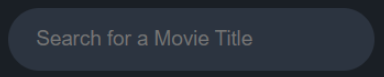
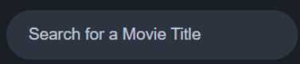
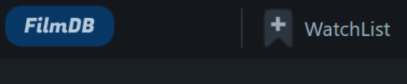
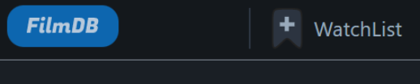
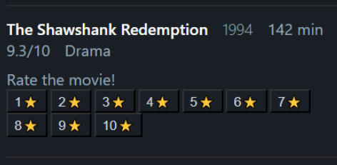
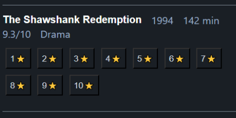
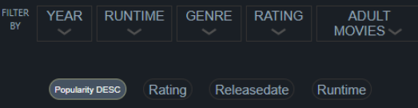
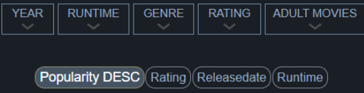
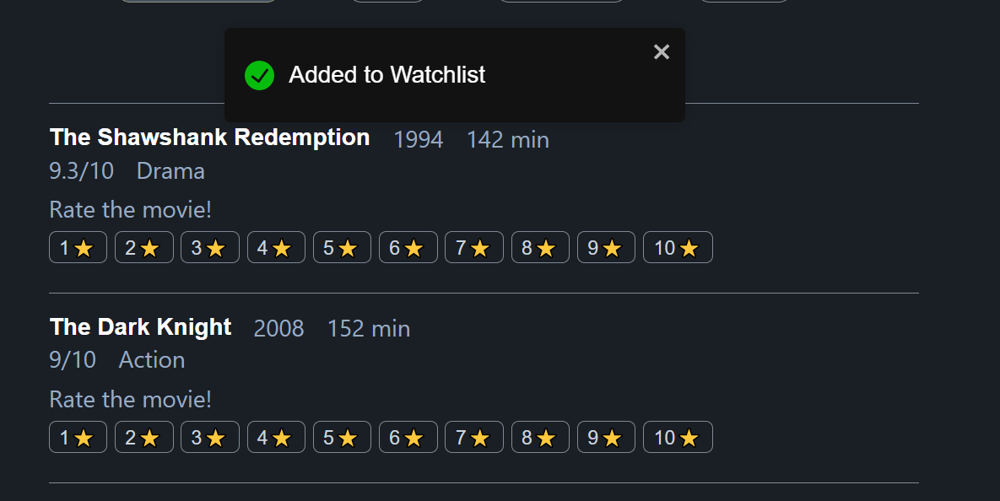

Dette prosjektet er en videreutvikling av prosjekt 3, med fokus på bearbeiding slik at applikasjonen tilfredsstiller kravene til WAD og WCAG 2.1 så langt det lar seg gjøre. Denne readme-filen vil fokusere på hvilke endringer vi har innført for å forbedre den universelle utformingen. For dokumentasjon av hvordan selve applikasjonen fungerer se [dokumentasjonen for prosjekt 3](https://gitlab.stud.idi.ntnu.no/it2810-h22/Team-36/p3-search-application/-/blob/main/README.md). Du finner også prototypen til prosjekt 3 [her](http://it2810-36.idi.ntnu.no/project3/), som kan bli brukt til å sammenligne med prosjekt 4.

## Kort om WAD og WCAG
WAD er et direktiv som ble innført i EU i 2016 og gjelder alle medlemsland. Direktivet setter krav om at offentlige organisasjoner skal følge spesifiserte krav for universell utforming. Nylig ble WAD oppdatert til å inkludere WCAG anbefalingene.

WCAG står for Web Content Accessibility Guidelines og er et sett med retningslinjer brukt for å gjøre webinnhold mer universelt utformet. Retningslinjene består av 78 kriterier fordelt inn i 4 kategorier: Mulig å oppfatte, Mulig å betjene, Forståelig, Robust. Hvert kriterium går også inn i ett av tre nivåer, A, AA, eller AAA, der antall A-er korresponderer med strengere krav for å ta hensyn til flere grupper og situasjoner. 

Hurtigreferanse til WCAG 2.1 kravene finner du her: https://www.w3.org/WAI/WCAG21/quickref/

I denne dokumentasjonen kommer vi ikke til å ta for oss hvert eneste krav i WCAG, ettersom det ville gjort dokumentasjonen for lang. WCAG retningslinjene er et over 80 siders langt dokument, og det er flere krav som ikke er aktuelle for vårt prosjekt.

## Lighthouse DevTools
Et nyttig verktøy vi har brukt under prosjektet er utviklerverktøyet Lighthouse i nettleseren Google Chrome. Lighthouse er et sett med automatiserte tester som kan måle kategorier som ytelse, “Best practices”, og ikke minst universell utforming. Verktøyet kjører en rekke tester, og kommer med forslag til hva som må sjekkes manuelt. Det er også flere tester som ikke blir kjørt. Grunnen til dette er at verktøyet ikke finner noe som utløser testene. Mange av testene som ikke blir kjørt handler om ARIA-attributter, noe vi ikke har brukt for mye i prosjektet da vi heller har fokusert på god bruk av semantiske HTML-elementer. Det er tross den [første regelen i bruk av ARIA i HTML](https://www.w3.org/TR/using-aria/#rule1) at dersom man kan bruke HTML elementer for å beskrive sideelementers bruksområde, er det å foretrekke framfor aria-attributter som `aria-role`.

Selv om Lighthouse har gitt nettsiden vår en toppscore på universell utforming, og vi har “godkjent” de manuelle testene betyr det ikke nødvendigvis at vi har fikset universell utforming. Bruker vi verktøyet på prosjekt 3 får vi ingen indikasjon på at f.eks. kontrastforholdet mellom bakgrunn og tekst, interaktive komponenter, osv. er bra.

## Tilbakemeldinger fra prosjekt 3
Medstudentvurderingene fra prosjekt 3 ga oss mange relevante tilbakemeldinger på hvordan applikasjonen kunne forbedres. Flere av tilbakemeldingene nevnte problematikk tilknyttet web accessibility, og derfor bestemte vi oss å velge denne oppgaven. En gjenganger i tilbakemeldingene var at fargekontrasten mellom enkelte sideelementer var lav, og kunne forårsake problemer for svaksynte. 

En annen nyttig tilbakemelding var at nettsiden hadde dårlig responsivitet. Ved liten skjermstørrelse, ble teksten og knappene svært små og vanskelig å lese eller interagere med. Ved zooming oppsto også diverse problemer, blant annet at enkelte sideelementer falt utenfor skjermen. Responsivt design er sterkt knyttet til universelt design, siden det handler om at applikasjoner skal være lesbare på ulike enheter, og ikke bare på standard PC-skjerm.  Vi fikk også beskjed om at en del funksjonalitet var utilgjengelig gjennom tastatur navigasjon. 

I tilbakemeldingene var det også diverse forslag til forbedringer generelt, som ikke spesifikt omhandlet universell utforming. Mange av disse forbedringsforslagene ble også implementert, siden bedre funksjonalitet generelt ikke er å forakte.

### Forbedring av fargekontraster
Hva WCAG sier om kontraster
Kontrast inngår i WCAG 2.1 seksjon 1, Mulig å oppfatte, del 4, Mulig å skille fra hverandre. Følgende kriteriene ser vi nærmere på knyttet tilbakemeldingene våre:
- **1.4.3**: Kontrast (Minimum) - Nivå AA:
    - Kontrastforholdet av tekst og bilder av tekst skal være minst 4,5:1 med følgende unntak:
        - Stor skriftstørrelse og bilder av stor skriftstørrelse skal ha et kontrastforhold på minst 3:1.
        - Logoer: Tekst som utgjør en del av en logo eller et varemerkenavn, er ikke underlagt kontrastkrav.
- **1.4.6**: Kontrast (Forbedret) - Nivå AAA:
    - Kontrastforhold av tekst og bilder av tekst skal være minst 7:1 med følgende unntak
        - Stor tekst: minst 4,5:1
        - Logoer
- **1.4.11**: Kontrast for ikke-tekstlig innhold - Nivå AA:
    - Kontrastforhold mellom den visuelle presentasjonen er på minst 3:1 mot farge(r) som ligger ved siden av:
        - Brukergrensesnittkomponenter: Visuell informasjon som kreves for å identifiserere brukergrensesnittkomponenter og tilstander, untatt inaktive komponenter eller der utseendet på komponentene er bestemt av brukeragenten og ikke endret av produsenter av nettinnhold
        - Grafiske objekter: Deler av grafikk som kreves for å forstå innholdet, unntatt tilfeller der en bestemt presentasjon av grafikk er avgjørende for informasjonen som blir formidlet.

Stor tekst her defineres som tekst som er 14+ punkter i bold, eller bare 18+ punkter.
Vi bruker verktøyet `Contrast Checker ` fra https://webaim.org/resources/contrastchecker/ for å se om fargevalgene stemmer overens med WCAG-kravene.

#### Tekst og bakgrunn i søkefeltet
Grunnet en feil i koden ble ikke placeholder-tekstfargen i søkefeltet satt riktig, noe som resulterte i en farge med svært dårlig kontrast med bakgrunnen på input-feltet. Dette har nå blitt fikset slik at kontrastforholdet mellom input-teksten og bakgrunnen på input-feltet er på 7,5:1.

*Før:*  
  
*Etter:*  

#### Navbar og Main
Fargekontrasten mellom hovedinnholdet av nettsiden og navbaren var svært lav, men likevel innenfor kravene spesifisert i WCAG, siden det finnes et unntak for “inaktive komponenter”. Selve navbaren er ikke interaktiv, kun knappene på den - derfor trenger strengt tatt ikke navbaren å skille seg ut fra resten av komponentene. Likevel bestemte vi oss for å legge til en skillelinje mellom hovedinnholdet og navbaren med høy kontrast, slik at navbaren vises tydeligere. Hvis vi ser på navbaren og innholdet i den finner vi at fargen på logoen har et utilstrekkelig kontrastforhold. ,. Logoen er ikke en inaktiv komponent, så for å gjøre hele logoen mer synlig gjorde vi blåfargen lysere og dermed mer distinkt.. Denne nye blåfargen har et kontrastforhold på 3:1 med resten av navbaren. Når det kommer til `WatchList`-knappen så har teksten et forhold på 7,5:1.

*Før:* 
 
*Etter:* 

#### Utgivelsesår på filmer
Fargene på utgivelsesår, filmlengde, rating, sjanger, og teksten 'Rate the movie!' har alle den samme blåfargen, som gir et kontrastforhold på 6,96:1. Dette er akkurat ikke nok for å tilfredsstille 1.4.6, så vi endret fargen til noe lysere. Alle andre elementer med tilsvarende blåfarge med også endret til å bli lysere for å være konsekvent. 

#### Skillelinje mellom resultatsettet
Vi tydeliggjorde skillelinjene mellom filmene i resultatsettet

*Før:*  
  
*Etter:*  

#### Border på filtrerings- og sorteringsknappene
Disse hadde et kontrastforhold på 1,29:1, som ikke engang er halvparten av kravet for brukergrensesnittkomponenter på 3:1. Dette fikset vi ved å til en lyseblå farge som matcher godt med fargepalettet. 

*Før:*  
  
*Etter:*  

#### Andre merkbare kontrastendringer
Border på ratingknappene 'Prev page', og 'Next page'. Fargen har blitt endret slik at det tilfredsstiller krav 1.4.11.

### Tastaturnavigering
I prosjekt 3 hadde vi mulighet til å navigere mesteparten av siden med tastatur, med enkelte unntak. I dette prosjektet har vi sørget for at funksjonalitet er mulig utelukkende gjennom tastaturet. Vi har fulgt WCAG sine retningslinjer for navigasjon som går ut på å, blant annet, unngå “tastaturfeller”, gi komponenter en fokus-rekkefølge som bevarer deres formål og brukbarhet, og å vise brukeren hvor fokuset befinner seg. Videre har vi bevisst laget en “fokusfelle” ved bruk av “focus-trap-react”-biblioteket som passer på at fokuset forblir på modalen når den dukker opp foran alle andre elementer. Denne fokusfellen blir fjernet når modalen fjernes, og fokuset rettes tilbake til den samme filmen som ble trykket på

### Brukerfeedback
#### Notifikasjons pop-up
Vi brukte “react-toastify”-biblioteket til å gi brukeren feedback på filmer som har blitt vurdert, lagt til watchlist eller fjernet fra watchlist. Feedbacken er i form av notifikasjoner som dukker opp på toppen av vinduet, og blir der i 5 sekunder (slik at også de med synsnedsettelser rekker å lese). Disse notifikasjonene er laget ved hjelp av en funksjonell komponent vi kaller “Notification” . 

*Et eksempel på en notifikasjons pop-up*

#### Hover-effects og active-effects
Vi har lagt til hover-effects på alle interagerbare elementer på nettsiden og endret utseendet på en rekke knapper når de er aktivert. 

#### Case-insensitivity
I prosjekt 3 var søkene case-sensitive, noe som er forvirrende for brukerne. Dette problemet er løst, men ikke på den mest effektive måten siden vi kaller på en ny attributt i databasen som er filmtittelen i bare små bokstaver. 

### Responsivitet
Som tidligere nevnt er responsivt design sterkt tilknyttet universelt design, siden det øker tilgjengeligheten av nettsiden. Vi hadde fått mange tilbakemeldinger om at nettsiden fungerte dårlig på enheter med liten vindustørrelse. Særlig ble det poengtert at knappene og enkelte tekstavsnitt var for små. Eksempelvis kunne det være vanskelig å selektere film-filtre på mobil. Følgelig har vi økt størrelsen på samtlige knapper, og introdusert skillelinjer til filternes dropdown-meny når skjermen er smal. Vi har bedret responsiviteten ved bl.a å flittigere ta i bruk media-queries, måleenheter som er skaleres etter viewporten og min/max funksjoner på tekststørrelse (slik at teksten eksempelvis aldri blir mindre enn et visst antall pixler). Nettsiden har også blitt justert slik at den fungerer på 400% zoom, noe som hjelper tilgjengeligheten for personer med synshemning. Responsiviteten ble testet hovedsakelig ved hjelp av Chrome’s innebygde responsivitetsverktøy, men vi oppdaget at enkelte problemer knyttet til lav skjermstørrelse ikke kan avdekkes gjennom dette verktøyet. Derfor testet vi også med egne mobiler, både ved horisontal og vertikal orientering.

### Avvik fra egne issues
Vi forsøkte å gjøre det slik at man ikke kan rangere en film flere ganger i samme økt, men løsningen vi fant gikk veldig hardt utover ytelse, da applikasjonen måtte iterere gjennom en liste over brukerrangerte filmer for hver film som ble lastet inn i resultatlisten, og deretter bestemme om rangerings-knappene skulle vises eller ikke. Dette ville vært en dårlig løsning med tanke på bærekraft, så vi har sløyfet det for denne gang, og i stedet fokusert på kravene som følger med oppgaven. 

Vi satte i gang med utvikling av light mode, men fant ut at det var litt for mye arbeid kontra hva applikasjonen ville tjent på det. Det å få på plass tilstrekkelige kontraster i designet var en ganske stor jobb, og hvis vi hadde laget light mode så hadde vi måttet gjøre den samme jobben på nytt, uten at det nødvendigvis hadde forbedret nettsidens kvalitet med hensyn på universell utforming.
